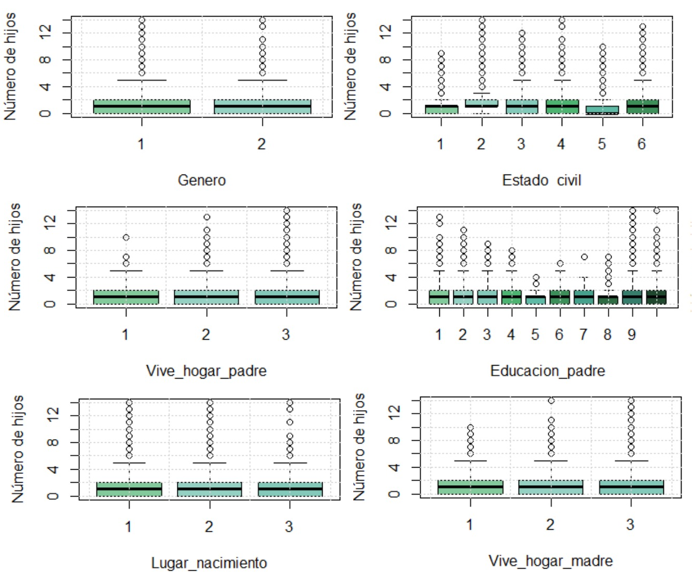
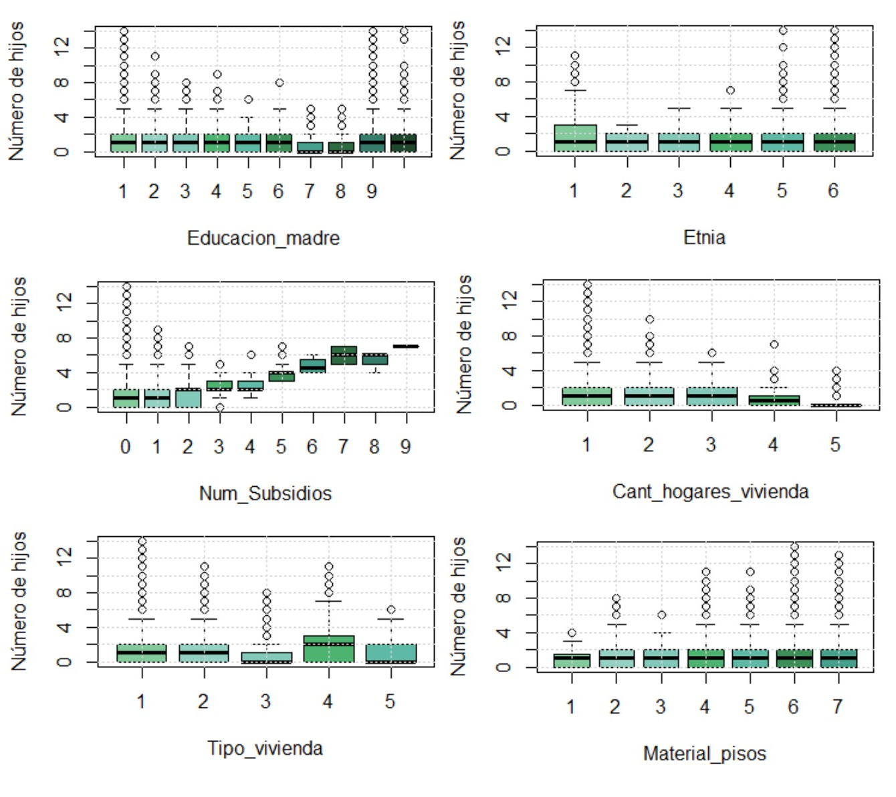

```{r setup, include=FALSE}
knitr::opts_chunk$set(echo = TRUE, message = FALSE,warning = FALSE)
```

# Introducción

<div style="text-align: justify">

En la actualidad, debido a la globalización es importante para las empresas conocer a sus clientes, la tecnología, sin duda ha permitido recaudar volúmenes enormes de información, sin embargo, en muchas ocasiones precisamente la información requerida por una empresa es difícil de obtener o representa información sensible para los usuarios, ya que invade su privacidad. No obstante, con los avances en analítica se han creado herramientas para lograr obtener la información necesaria de los usuarios sin invadir su intimidad y está ha podido utilizarse para estimar valores sobre el resto de la población aun sin tener que preguntar directamente sobre la misma.

Entre los datos que en algunos contextos pueden ser censurados u omitidos está el número de hijos en un hogar, lo que hace que sea una variable de la que no se dispone directamente; por lo tanto el problema en particular en el que se está interesado es en la predicción del número de hijos en base a las características de los hogares colombianos.
Para esto usamos la encuesta de la ECV del DANE de 2019. De ella se seleccionaron algunas variables y mediante análisis estadísticos se obtuvieron modelos que pudieran dar solución al problema. Por último se seleccionó uno de ellos mediante criterios que se expondrán más adelante.

<div/>

# Retos

## Contextualización del conjunto de datos:

El número de hijos en un hogar es una variable muy simple y poco estudiada en algunos contextos, por eso los volúmenes de datos que se encuentran en la web muchas veces no disponen de este tipo de información, pero para entidades como inmobiliarias, empresa crediticias, etc; puede serles de sumo interés, por ello bajo trabajos de investigación se llega a la conclusión de que estas variables pueden ser deducidas a partir de otras que siguen en el mismo contexto, en este caso particular el número de hijos puede ser deducida a partir de conjuntos de datos relacionados con información acerca de los hogares del país, en cómo es su estructura, a partir de información puntual de cada uno de los integrantes, sin previamente haber recibido información de cuántos de esos integrantes son hijos, por tanto una de las bases de datos que se considera tienen más relación con las viviendas y hogares de Colombia es la encuesta de Calidad de vida, donde la más actualizada hasta la fecha es la realizada en el año 2019.

La Encuesta de Calidad de Vida (ECV) es una investigación que realiza el DANE, con el objetivo de recoger información sobre diferentes aspectos y dimensiones del bienestar de los hogares, incluyendo aspectos como el acceso a bienes y servicios públicos, privados o comunales, salud, educación, cuidado de niños y niñas menores de 5 años, entre otros. Esta información posibilita efectuar análisis posteriores de los factores que explican los diferentes niveles de vida existentes en la población colombiana.

Por ello mediante este conjunto de datos que tiene un gran volumen se intenta extraer aquellas variables que se consideran más representativas para intentar predecir el número de hijos que tienen cada uno de los hogares; Antes de ello se debe de definir para este investigación que es un hogar y que es el número de hijos, para realizar todos los análisis posteriores en función de esta variable (Número de hijos en el hogar).


### Definiciones importantes

__Usuario__

Inmobiliarias, empresas crediticias, en las cuales el número de hijos es una información sensible ya que este puede suponerse como un impedimento ya sea a la hora de conseguir o rentar apartamento o para conseguir préstamos ya que se concibe que el mantenimiento de los hijos es elevado y este sube cuantos más hijos posee el prestatario por lo que resulta más complicado para los padres de familia acceder a los mismos. 

Agencias o constructoras inmobiliarias en ocasiones tienen mucha información histórica de los clientes, sobretodo de los jefes de hogar, obteniendo así información relevante de las características de un hogar. En base a estas características podemos predecir el número de hijos del mismo, lo cual pueden utilizar dichas empresas para lanzar nuevos proyectos y ofrecer atención más personalizada a los hogares. Adicionalmente, algunas empresas que facilitan el arriendo como intermediarios pueden tener políticas de arriendo como el hecho de que no se admiten hijos en los hogares, esto es común en residencias estudiantiles, entre otros.

__Hogar__

Según el DANE se entiende como hogar a una persona o grupo de personas que ocupan la totalidad o parte de una vivienda y que se han asocian para compartir su lugar de descanso, alimentos y demás necesidades básicas (si se trata de hogar-unidad doméstica) . Pueden ser familiares o no entre sí.

Un hogar no puede dividirse en más de una vivienda, pero dentro de cada vivienda, puede haber más de un hogar, conformado por una o más personas con o sin vínculos de parentesco.

__Número de hijos__

Se define el número de hijos de acuerdo con los hogares colombianos promedio definidos por el DANE, en los cuales se tienen:

* Parejas con hijos.
* Una persona sola.
* Padre o madre y sus hijos.
* Parejas sin hijos.
* Hogar extenso-compuesto, definido como hogares nucleares (alguna de las opciones anteriormente mencionadas)  más otros parientes.

Se muestra a continuación una imagen que ejemplifica mejor lo antes mencionado:

<center>


</center>

En base a esto se considera como el número de hijos, a los hijos, hijastros y nietos del jefe del hogar sin discriminar por edad, ya que esta es la forma que en general funciona mejor en base a la mayoría de estructuras de los hogares en Colombia.

En casos generales funciona esta estructura ya que en la mayoría de hogares cuenta con padres y si estos no están presentes, los abuelos de los hijos lo están, ya que en casos donde se considera que si hay varios grupos familiares en una misma vivienda, como lo son por ejemplo varios hermanos con sus respectivos hijos, estos se dividirán en diferentes hogares ya que son varios núcleos familiares en una misma vivienda los cuales deben ser tomados como hogares de manera independiente, por lo tanto estructuras como estas no sesgan la elección de la variable del número de hijos, además que cabe aclarar que la encuesta de calidad de vida hace esta misma división, ya que en una misma vivienda se ven presentes varios hogares(siendo 5 el máximo), por lo tanto esta variable fue seleccionada como el criterio más correcto en base a la estructura de la encuesta de calidad de vida y en la perspectiva de los investigadores.

# Materiales

## Contextualización de las variables utilizadas

### Características y composición del hogar.

Compuesta por 46 variables de las cuales se escogieron

<table>
        <tr>
            <th>Código</th>
            <th>Nombre</th>
            <th>Pregunta</th>
        </tr>
        <tr>
            <td>P6040</td>
            <td>Genero</td>
            <td>Sexo:
                1 Hombre
                2 Mujer                 
            </td>
        </tr>
        <tr>
            <td>P6040</td>
            <td>Edad</td>
            <td>¿Cuántos años cumplidos tiene … ?</td>
        </tr>
        <tr>
            <td>P6051</td>
            <td>-</td>  
            <td>¿Cuál es el parentesco de ___ con el jefe o la jefa de este hogar?
                1 Jefe (a) del hogar
                2 Pareja, esposo (a), cónyuge, compañero(a)
                3 Hijo(a) hijastro(a)
                4 Nieto (a)
                5 Padre, madre, padrastro y madrastra
                6 Suegro o suegra
                7 Hermano (a), hermanastro (a)
                8 Yerno, nuera
                9 Otro pariente del jefe(a)
                10 Empleado(a) del servicio doméstico
                11 Parientes del servicio doméstico
                12 Trabajador
                13 Pensionista
                14 Otro pariente                
            </td>
        </tr>
        <tr>
            <td>P5502</td>
            <td>Estado_civil</td>
            <td>Actualmente el jefe del hogar:
                1 No está casado(a) y vive en pareja hace menos de dos años
                2 No está casado(a) y vive en pareja hace dos años o más
                3 Está viudo(a)
                4 Está separado(a) o divorciado(a)
                5 Está soltero(a)
                6 Está casado(a)
            </td>
        </tr>
        <tr>
            <td>P756</td>
            <td>Lugar_nacimiento</td>
            <td>¿Dónde nació el jefe del hogar?
                1 En este municipio
                2 En otro municipio
                3 En otro país    
            </td>
        </tr>
        <tr>
            <td>P6081</td>
            <td>Vive_hogar_padre</td>
            <td>¿El padre del jefe del hogar vive en este hogar?</td>
        </tr>
        <tr>
            <td>P6087</td>
            <td>Educacion_padre</td>
            <td>¿Cuál es o fue el nivel de educación más alto alcanzado por el padre del jefe del hogar?</td>
        </tr>
        <tr>
            <td>P6083</td>
            <td>Vive_hogar_madre</td>
            <td>¿La madre del jefe del hogar vive en este hogar?</td>
        </tr>
        <tr>
            <td>P6088</td>
            <td>Educacion_madre</td>
            <td>¿Cuál es o fue el nivel de educación más alto alcanzado por la madre del jefe del hogar?</td>
        </tr>
        <tr>
            <td>P6080</td>
            <td>Etnia</td>
            <td>De acuerdo con su cultura, pueblo o rasgos físicos, _____ es o se reconoce como:
                1 Indígena
                2 Gitano (a) (Rom)
                3 Raizal del archipiélago de San Andrés, Providencia y Santa Catalina
                4 Palenquero (a) de San Basilio
                5 Negro (a), mulato (a) (afrodescendiente), afrocolombiano(a)
                6 Ninguno de los anteriores
            </td>
        </tr>
</table>

### Condiciones de vida del hogar y tenencia de bienes (programas).

Compuesta por 8 variables de las cuales se escogió:

<table>
        <tr>
            <th>Código</th>
            <th>Nombre</th>
            <th>Pregunta</th>
        </tr>
        <tr>
            <td>P784S4A3</td>
            <td>Num_subsidios</td>
            <td>¿Cuántos miembros del hogar reciben subsidios?</td>
        </tr>
</table>

### Datos de la vivienda.

Compuesta por 35 variables de las cuales se escogieron:

<table>
        <tr>
            <th>Código</th>
            <th>Nombre</th>
            <th>Pregunta</th>
        </tr>
        <tr>
            <td>P1070</td>
            <td>Tipo_vivienda</td>
            <td>Tipo de vivienda:
                1 Casa
                2 Apartamento
                3 Cuarto(s)
                4 Vivienda tradicional indigena
                5 Otro (carpa, contenedor, vagón, embarcación, cueva, refugio natural, etc
            </td>
        </tr>
        <tr>
            <td>P4015</td>
            <td>Material_pisos</td>
            <td>Material predominante de los pisos:
                1 Alfombra o tapete de pared a pared
                2 Madera pulida y lacada, parqué
                3 Mármol
                4 Baldosa, vinilo, tableta, ladrillo, laminado
                5 Madera burda, tabla, tablón, otro vegetal
                6 Cemento, gravilla
                7 Tierra, arena
            </td>
        </tr>
        <tr>
            <td>P8520S1</td>
            <td>Energia_electrica</td>
            <td>¿La vivienda cuenta con energía eléctrica?
                1 Sí
                2 No
            </td>
        </tr>
        <tr>
            <td>P8520S1A1</td>
            <td>Estrato</td>
            <td>Estrato para tarifa de la energía eléctrica:
                1 Bajo - Bajo
                2 Bajo
                3 Medio - Bajo
                4 Medio
                5 Medio - Alto
                6 Alto
                8 Planta eléctrica
                9 No conoce el estrato o no cuenta con recibo de pago.
                0 Recibos sin estrato o el servicio es pirata
            </td>
        </tr>
        <tr>
            <td>P8520S5</td>
            <td>Acueducto</td>
            <td>¿La vivienda cuenta con acueducto?
                1 Sí
                2 No
            </td>
        </tr>
        <tr>
            <td>P8520S3</td>
            <td>Alcantarillado</td>
            <td>¿La vivienda cuenta con alcantarillado?
                1 Sí
                2 No
            </td>
        </tr>
        <tr>
            <td>P8520S4</td>
            <td>Basuras_semana</td>
            <td>¿Cuenta con servicio de Recolección de basuras?
                1 Sí
                2 No
            </td>
        </tr>
</table>

### Educación.

Compuesta por 58 variables de las cuales se escogieron:

<table>
        <tr>
            <th>Código</th>
            <th>Nombre</th>
            <th>Pregunta</th>
        </tr>
        <tr>
            <td>P8586</td>
            <td>Estudia</td>
            <td>¿El jefe del hogar actualmente estudia? (asiste al preescolar, escuela, colegio o universidad)
                1 Sí
                2 No
            </td>
        </tr>
        <tr>
            <td>P8587</td>
            <td>Nivel_educativo</td>
            <td>¿Cuál es el nivel educativo más alto alcanzado por el jefe del hogar  y el último año o grado aprobado en este nivel?
                1 Ninguno
                2 Preescolar
                3 Básica Primaria (1º - 5º)
                4 Básica secundaria (6º--9º)
                5 Media (10º--13º)
                6 Técnico sin título
                7 Técnico con título
                8 Tecnológico sin título
                9 Tecnológico con título
                10 Universitario sin titulo
                11 Universitario con titulo
                12 Postgrado sin titulo
                13 Postgrado con titulo
            </td>
        </tr>
</table>

### Salud.

Compuesta por 103 variables de las cuales se escogieron:

<table>
        <tr>
            <th>Código</th>
            <th>Nombre</th>
            <th>Pregunta</th>
        </tr>
        <tr>
            <td>P6090</td>
            <td>Afiliado</td>
            <td>¿El jefe del hogar está afiliado (a), es cotizante o es beneficiario (a) de alguna entidad de seguridad social en salud? (Entidad promotora de salud [EPS] o entidad promotora de salud subsidiada EPS-S)
                1 Sí
                2 No
                9 No sabe, no informa
            </td>
        </tr>
        <tr>
            <td>P6127</td>
            <td>Salud_general</td>
            <td>El estado de salud del jefe del hogar en general, es:
                1 Muy bueno
                2 Bueno
                3 Regular
                4 Malo
            </td>
        </tr>
</table>
    
### Servicios del hogar.

Compuesta por 64 variables de las cuales se escogieron:

<table>
        <tr>
            <th>Código</th>
            <th>Nombre</th>
            <th>Pregunta</th>
        </tr>
        <tr>
            <td>P5666</td>
            <td>Gas_natural</td>
            <td>¿En este hogar tienen servicio de Gas Natural conectado a red pública?
                1 Sí
                2 No
            </td>
        </tr>
        <tr>
            <td>P5305</td>
            <td>Telefonia_fija</td>
            <td>¿En este hogar tienen servicio telefónico fijo?
                1 Sí
                2 No
            </td>
        </tr>
        <tr>
            <td>I_HOGAR</td>
            <td>Ingresos_hogar</td>
            <td>Ingreso Mensual Total del Hogar</td>
        </tr>
</table>

### Tenencia y financiación de la vivienda que ocupa el hogar.

Compuesta por 20 variables de las cuales se escogieron:

<table>
        <tr>
            <th>Código</th>
            <th>Nombre</th>
            <th>Pregunta</th>
        </tr>
        <tr>
            <td>P5095</td>
            <td>Contrato_vivienda</td>
            <td>¿La vivienda ocupada por este hogar es?
                1. Propia, totalmente pagada
                2. Propia, la están pagando
                3. En arriendo o subarriendo
                4. Con permiso del propietario, sin pago alguno (usufructuario)
                5. Posesión sin título (ocupante de hecho)
                6. Propiedad colectiva
            </td>
        </tr>
</table>
    
### Uso de energéticos del hogar.

Compuesta por 45 variables de las cuales se escogieron:

<table>
        <tr>
            <th>Código</th>
            <th>Nombre</th>
            <th>Pregunta</th>
        </tr>
        <tr>
            <td>P5018</td>
            <td>Ultimo_pago_energia</td>
            <td>¿Cuánto pagaron EL MES PASADO o la última vez por la electricidad consumida?</td>
        </tr>
        <tr>
            <td>P5018S1</td>
            <td>-</td>
            <td>¿A cuántos meses corresponde el pago de la última vez por la electricidad consumida?</td>
        </tr>
</table>

### Variables construidas a partir de otras.

<table>
        <tr>
            <th>Código</th>
            <th>Nombre</th>
            <th>Variables utilizadas</th>
        </tr>
        <tr>
            <td>P5018S</td>
            <td>Pago_mes_energia</td>
            <td>Esta variable fue creada dividiendo P5018/P5018S1 con el fin de obtener el pago mensual de electricidad</td>
        </tr>
        <tr>
            <td>Num_integrantes</td>
            <td>Num_integrantes</td>
            <td>Esta variable fue creada sumando 1 unidad cada vez que el número de ORDEN cambiaba</td>
        </tr>
        <tr>
            <td>Num_hijos</td>
            <td>Num_hijos</td>
            <td>Esta variable fue creada sumando 1 cada vez que la pregunta código P6051 toma el valor de 3 o 4 correspondiente a hijo o nieto</td>
        </tr>
</table>

# Metodología

## Preprocesamiento de los datos

### Creación de la variable número de hijos 

Debido a que la variable de interés (Número de hijos) no aparece de manera explícita, se llevó a cabo un proceso de construcción de la misma. Esto fue posible gracias a algunas de las variables de la base de datos Características y composición del hogar, presente en la encuesta antes mencionada que permiten conocer la relación de cada individuo con el jefe del hogar.

Como primer paso se realiza la lectura de las bases de datos:

```{r}
Caracteristicas_hogar_personas <- read.table("Caracteristicas y composicion del hogar.csv", sep = ";", header = T)
```


Debido a que la variable P6051 muestra el parentesco de los integrantes de la familia con el jefe de hogar solo será utilizada para la creación de la variable número de hijos, es decir, no se tiene en cuenta como covariable para el ajuste de modelos:

```{r}
#Selección de las variables necesarias
aux_creacion_respuesta<-Caracteristicas_hogar_personas[,c("ï..DIRECTORIO","SECUENCIA_P","P6051")]
```

Para obtener el número de hijos por hogar se filtra las filas si tienen una relacion de hijo/hija o nieto/nieta con el jefe de hogar y se cuenta el número de hijos por hogar. Los hogares se describen con el código único de ï..DIRECTORIO, SECUENCIA_P

```{r}
require(dplyr)

# P6051 = 3 : Hijo/hija/hijastro
# P6051 = 4 : Nieto/nieta

num_hijos <- aux_creacion_respuesta %>%
  filter(P6051 == 3 | P6051 == 4) %>%
  group_by(ï..DIRECTORIO, SECUENCIA_P) %>%
  count(SECUENCIA_P)
```


```{r,echo=FALSE}
require(kableExtra)
kable(head(num_hijos))%>%
  kable_styling(full_width = F)
```

El número de hogares que tiene al menos un hijo `r dim(num_hijos)[1]`.

A continuación se procede a calcular el número de integrantes que pertenecen a cada hogar:


```{r}
require(dplyr)
num_integrantes <- Caracteristicas_hogar_personas %>%
  group_by(ï..DIRECTORIO, SECUENCIA_P) %>%
  count(SECUENCIA_P)
```


```{r,echo=FALSE}
require(kableExtra)
kable(head(num_integrantes))%>%
  kable_styling(full_width = F)
```

El número de hogares es `r dim(num_integrantes)[1]`.

Finalmente, con la función _merge_ se obtiene el número de hijos en cada hogar uniendo las bases de datos _num_integrantes_ y _num_hijos_ como sigue:

```{r}
num_hijos_final <- merge(num_integrantes, num_hijos, by =c("ï..DIRECTORIO","SECUENCIA_P"), all.x=TRUE)

num_hijos_final$n.y[is.na(num_hijos_final$n.y)] <- 0
colnames(num_hijos_final) <- c("ï..DIRECTORIO","SECUENCIA_P", "Num Integrantes", "Num Hijos")
```

```{r,echo=FALSE}
require(kableExtra)
kable(head(num_hijos_final,10))%>%
  kable_styling(full_width = F)
```


### Selección de variables

Como paso siguiente se realizó de manera exhaustiva en cada una de las bases de la ECV, una preselección de covariables que a criterio de los investigadores, podrían tener alguna relación con la variable respuesta. Con la información anterior se procede a construir la base de datos para el paso siguiente.

A continuación se muestra la base que se obtuvo con las variables preseleccionadas que aparecen listadas en la contextualización de los datos:

```{r,eval=FALSE}

# Características del hogar

Caracteristicas_hogar_personas <- read.table("Caracteristicas y composicion del hogar.csv", sep = ";", header = T)
Caracteristicas_hogar_personas<-Caracteristicas_hogar_personas[,c("ï..DIRECTORIO","SECUENCIA_P","ORDEN","P6020", "P6040","P6051", "P5502", "P756","P6081", "P6087","P6083","P6088","P6080")]

# Condiciones de vida del hogar y tenencia de bienes (programas)

condiciones_de_vida <- read.table("Condiciones de vida del hogar y tenencia de bienes (programas).csv", sep=";", header = T)
condiciones_de_vida <- condiciones_de_vida[, c("ï..DIRECTORIO","SECUENCIA_ENCUESTA","ORDEN","P784S4A3")]

# Datos de la vivienda

Datos_vivienda <- read.table("Datos de la vivienda.csv", sep = ";", header = T)
Datos_vivienda<-Datos_vivienda[,c("ï..DIRECTORIO","SECUENCIA_P","ORDEN","CANT_HOGARES_VIVIENDA","P1070","P4015","P8520S1","P8520S1A1","P8520S5","P8520S3", "P8520S4A1")]

# Educación

Educacion<- read.table("Educacion.csv", sep = ";", header = T)
Educacion<-Educacion[,c("ï..DIRECTORIO","SECUENCIA_P","ORDEN","P8587","P8586")]

# Fuerza de trabajo 

fuerza_trabajo <- read.table("Fuerza de trabajo.csv", sep=";", header = T)
fuerza_trabajo <- fuerza_trabajo[, c("ï..DIRECTORIO","SECUENCIA_P","ORDEN", "P6435")]

# Salud

Salud<- read.table("Salud.csv", sep = ";", header = T)
Salud<-Salud[,c("ï..DIRECTORIO","SECUENCIA_P","ORDEN","P6090","P6127")]

# Servicios del hogar

ServiciosDelHogar<- read.table("Servicios del hogar.csv", sep = ";", dec=",", header = T)
ServiciosDelHogar<-ServiciosDelHogar[,c("ï..DIRECTORIO","SECUENCIA_ENCUESTA","ORDEN","P5000","P5666","P5305", "I_HOGAR")]

# Tecnología e información y comunicación

tecn_inf_comunicacion <- read.table("Tecnologías de información y comunicación.csv", sep=";", header = T) 
tecn_inf_comunicacion <- tecn_inf_comunicacion[, c("ï..DIRECTORIO","SECUENCIA_P","ORDEN","P769")]

# Tenencia y financiación de la vivienda que ocupa el hogar

financiacion_vivienda <- read.table("Tenencia y financiación de la vivienda que ocupa el hogar.csv", sep=";", header = T)
financiacion_vivienda <- financiacion_vivienda[,c("ï..DIRECTORIO","SECUENCIA_ENCUESTA","ORDEN","P5095")]

# Uso de energéticos del hogar

energeticos_hogar <- read.table("Uso de energéticos del hogar.csv", sep=";", header = T)
energeticos_hogar <- energeticos_hogar[,c("ï..DIRECTORIO","SECUENCIA_ENCUESTA","ORDEN", "P5018", "P5018S1")]
```

### Unión de las bases de datos:

Se creó una única base de datos con la variable de interés (Número de hijos) y las demás variables seleccionadas. Dado que las posibles variables explicativas provenían de diferentes tablas, se procedió a realizar un merge entre ellas, usando como variable de referencia la columna “Directorio” y “Secuencia” que son las dos variables que identifican a un hogar, y teniendo especial cuidado en la unión de tablas donde las preguntas pueden ser por vivienda, hogar o integrantes y se debía llevar a una misma estructura de hogares.

```{r,eval=FALSE}

# Merge de la base de datos de caracteristicas del hogar con condiciones de vida

Base1 <- merge(Caracteristicas_hogar_personas, condiciones_de_vida, by.x = c("ï..DIRECTORIO","SECUENCIA_P"), by.y = c("ï..DIRECTORIO","SECUENCIA_ENCUESTA"), all.x =TRUE)

# Merge de Base1 con datos vivienda

Base2 <- merge(Base1, Datos_vivienda, by="ï..DIRECTORIO", all.x=T)

# Merge de Base2 con educación

Base3 <- merge(Base2, Educacion, by =c("ï..DIRECTORIO","SECUENCIA_P", "ORDEN"), all.x=TRUE)

# Merge de todas las bases de datos restantes

## Bases de personas

Base4 <- Reduce(function(...) merge (..., by=c("ï..DIRECTORIO","SECUENCIA_P", "ORDEN"), all=T), list(Base3, fuerza_trabajo, Salud, tecn_inf_comunicacion))
Base4[,c("ORDEN")] <- NULL

## Bases de hogares

Base5 <- Reduce(function(...) merge (..., by= c("ï..DIRECTORIO","SECUENCIA_ENCUESTA", "ORDEN"), all=T), list(ServiciosDelHogar, financiacion_vivienda, energeticos_hogar))
Base5[,c("ORDEN")] <- NULL
```

Una vez obtenida la base 4 agrupada por i..DIRECTORIO y SECUENCIA_P y la base 5 agrupada por i..DIRECTORIO y SECUENCIA_ENCUESTA se procede a agruparlas igualando SECUENCIA_P con SECUENCIA_ENCUESTA.

```{r,eval=FALSE}
Base6 <- merge(Base4, Base5, by.x =c("ï..DIRECTORIO","SECUENCIA_P"),
               by.y =c("ï..DIRECTORIO","SECUENCIA_ENCUESTA"), all=TRUE)
```

Finalmente, se agrupa la base anterior con la base que contiene el número de hijos, obteniendo:

```{r,eval=FALSE}

# Base final

Base_final <- merge(Base6, num_hijos_final, by =c("ï..DIRECTORIO","SECUENCIA_P"), all.x=TRUE)
Base_final[,c("P6435","P6051","P5018S1","ï..DIRECTORIO","SECUENCIA_P")] <- NULL

```

```{r,echo=FALSE}
load(file = "datos.RData")
kable(head(Base_final))%>%
  kable_styling()%>%
  scroll_box(width = "100%", height = "320px")
```

### Medidas de localización y escala

Se realizó un  análisis descriptivo a cada variable donde se identificó el rango y media de las variables continuas y discretas respectivamente, y la proporción de cada clase en las variables categóricas, además de la identificación de las variables con valores faltantes.

```{r}
require(knitr)
kable(summary(Base_final))%>%
  kable_styling()%>%
  scroll_box(width = "100%", height = "320px")
```

Se decidió remover de la base de datos a aquellas variables cuyos valores faltantes superar un tercio de la cantidad de registros en la base de datos.

### Gráficos descriptivos 

Con el fin de depurar la base de datos, mediante gráficos se realizó un análisis descriptivo de las variables.

```{r, echo=FALSE}
nombres <- c(
  "Genero","Edad","Estado_civil","Lugar_nacimiento","Vive_hogar_padre","Educacion_padre","Vive_hogar_madre","Educacion_madre","Etnia","Num_Subsidios","Cant_hogares_vivienda","Tipo_vivienda","Material_pisos","Energia_electrica","Estrato","Acueducto","Alcantarillado","Basuras_semana","Nivel_educativo","Estudia","Afiliado","Salud_general","Uso_celular","Num_cuartos","Gas_natural","Telefonia_fija","Ingresos_hogar","Contrato_vivienda","Ultimo_pago_energia","Pago_mes_energia","Num_integrantes","Num_hijos"
)
colnames(Base_final) <- nombres
```

Para finalizar la etapa de preprocesamiento, se crearon gráficos Boxplots del Número de hijos vs las variables categóricas, respectivamente, con el fin de analizar la posible influencia o relación de cada predictora con la respuesta.

```{r, eval=FALSE}
sapply(1:32, function(i){
  boxplot(Base_final$Num_hijos~Base_final[, i], xlab = nombres[i])
})
```





Y para las variables numericas se utilizan graficos de puntos vs Num_hijos para analizar la posible influencia o relación de cada predictora con la respuesta.

```{r, eval=FALSE}
par(mfrow=c(2,2))
plot(Base_final$Num_hijos~ Base_final$Edad)
plot(Base_final$Num_hijos~ Base_final$Ingresos_hogar)
plot(Base_final$Num_hijos~ Base_final$Ultimo_pago_energia)
plot(Base_final$Num_hijos~ Base_final$Pago_mes_energia)
```


####  Variables escogidas a partir de los graficos descriptivos

```{r}
var_interesantes <- c(
  "Genero",
  "Edad",
  "Num_integrantes",
  "Num_cuartos",
  "Estrato",
  "Tipo_vivienda",
  "Num_Subsidios",
  "Educacion_madre",
  "Estado_civil",
  "Ultimo_pago_energia",
  "Ingresos_hogar",
  "Cant_hogares_vivienda",
  "Num_hijos"
)
```

Se realiza un subset con las variables interesantes

```{r, echo=FALSE}
require(kableExtra)

Base_interesante <- subset(Base_final, select = var_interesantes)
kable(head(Base_interesante))%>%
  kable_styling()%>%
  scroll_box(width = "100%", height = "320px")
```

Las variables categoricas de Base_interesante se convierten a factor y se crea un modelo de regresión lineal multiple para poder utilizar regresión por pasos

### Regresión por pasos

```{r, echo=FALSE}
# Se pasan algunas variables a factores

Base_interesante <-  Base_interesante %>% 
  mutate(
    Genero = factor(Genero),
    Estrato = factor(Estrato),
    Tipo_vivienda = factor(Tipo_vivienda),
    Educacion_madre = factor(Educacion_madre),
    Estado_civil = factor(Estado_civil)
)
```

```{r}
mod1 <- lm(Num_hijos~., data = Base_interesante)
```

Para la preseleccion de variables tambien se utilizaron métodos de selección de variables tales como regresión por pasos y Lasso.

```{r}
require(olsrr)
ols_step_both_p(mod1)
```

### Selección de las variables de interés con lasso

Se toma la Base_final que posee 32 variables y se convierten las variables categóricas a factor. Se eliminan las variables con mayor número de NA y se eliminan las filas con NA.

```{r, echo=FALSE}
Base_final <- Base_final %>% 
  mutate(
    Genero = factor(Genero),
    Estado_civil = factor(Estado_civil),
    Lugar_nacimiento = factor(Lugar_nacimiento),
    Vive_hogar_padre = factor(Vive_hogar_padre),
    Educacion_padre = factor(Educacion_padre),
    Vive_hogar_madre = factor(Vive_hogar_madre),
    Educacion_madre = factor(Educacion_madre),
    Etnia = factor(Etnia),
    Tipo_vivienda = factor(Tipo_vivienda),
    Material_pisos = factor(Material_pisos),
    Energia_electrica = factor(Energia_electrica),
    Estrato = factor(Estrato),
    Acueducto = factor(Acueducto),
    Alcantarillado = factor(Alcantarillado),
    Nivel_educativo = factor(Nivel_educativo),
    Estudia = factor(Estudia),
    Afiliado = factor(Afiliado),
    Salud_general = factor(Salud_general),
    Uso_celular = factor(Uso_celular),
    Gas_natural = factor(Gas_natural),
    Telefonia_fija = factor(Telefonia_fija),
    Contrato_vivienda = factor(Contrato_vivienda)
)

Base_basuras <- Base_final
Base_basuras <- na.omit(Base_basuras)

Base_menos_Nas <- Base_final
Base_menos_Nas$Basuras_semana <- NULL
Base_menos_Nas$Pago_mes_energia <- NULL
Base_menos_Nas <- na.omit(Base_menos_Nas)
```

Se crea una matriz de diseño para aplicar regresión Lasso

```{r}
x <- model.matrix(Num_hijos ~ ., Base_menos_Nas)[,-1]
y <- Base_menos_Nas$Num_hijos

# Aplicación de la técnica de regularización

require(glmnet)

gridz <- 10^seq(-2,10, length = 100)
lasso.mod <- glmnet(x, y, alpha = 1, lambda = gridz)
```

```{r, echo=FALSE}
#require(plotmo)
#plot_glmnet(lasso.mod, xvar = 'lambda', grid.col="lightgray", #label = 5, xlim = c(-5, 0.5))
```

Se hace validación cruzada para seleccionar el $\lambda$ óptimo para aplicar lasso.

```{r}
set.seed(23)
train <- sample(1:nrow(x), nrow(x)/2)
test <- -train
y.test <- y[test]
cv.out <- cv.glmnet(x[train,], y[train], alpha=1)
bestlam <-cv.out$lambda.min

out <- glmnet(x, y, alpha=1)
lasso.coef <-predict(out, type = "coefficients", s=bestlam)[1:90, ]
```

```{r,echo=FALSE}
require(broom)
```

##### Insertar tabla

Con los anteriores procesos, se obtiene la siguiente base, que se usará en la parte de modelamiento

```{r,echo=FALSE}
Base_modelar <- Base_final[,c("Genero", 
                              "Edad",
                              "Num_integrantes",
                              "Num_cuartos",
                              "Estrato",
                              "Tipo_vivienda",
                              "Num_Subsidios",
                              "Educacion_madre",
                              "Estado_civil",
                              "Ultimo_pago_energia",
                              "Ingresos_hogar",
                              "Cant_hogares_vivienda",
                              "Num_hijos",
                              "Uso_celular", 
                              "Vive_hogar_madre", 
                              "Contrato_vivienda",
                              "Etnia",
                              "Afiliado",
                              "Lugar_nacimiento",
                              "Nivel_educativo")]
```

```{r}
kable(head(Base_modelar))%>%
  kable_styling(bootstrap_options = c("striped", "hover"))%>%
  row_spec(c(0,1,2,3,4,5,6),align = "center")%>%
  scroll_box(height = "320px")
```


# Conclusiones

# Bibliografía

* Bonilla Jaime, G., & Garcia Valdez, E. (2009). Impacto de las condiciones socioeconomicas familiares en las decisiones de fertilidad (numero de hijos), utilizando un modelo de regresión poisson: período de estudio 2005-2006 (Bachelor's thesis).

* Forero, Nohora, & Gamboa, Luis Fernando. (2009). Family Size in Colombia: Guessing or Planning? Intended vs. Actual Family Size in Colombia. Desarrollo y Sociedad, (64), 85-118. Retrieved March 31, 2021, Recuperada de http://www.scielo.org.co/scielo.php?script=sci_arttext&pid=S0120-35842009000200004&lng=en&tlng=en. 

* García, D. & Jaramillo, A. (6 de Enero de 2019). El cambio social que se gesta en los hogares colombianos. El Tiempo. https://www.eltiempo.com/economia/sectores/que-implica-que-los-hogares-colombianos-sean-mas-pequenos-analisis-censo-2018-311776

* Robayo, E. P. (2019). Tipología del hogar en Colombia  (2000-2015): Características Sociodemográficas de las mujeres. (Tesis de Maestría, Universidad Externado de Colombia). Recuperada de https://bdigital.uexternado.edu.co/bitstream/001/2223/1/DKA-spa-2019-Tipologias_de_hogar_en_Colombia_2000_2015_caracteristicas_sociodemograficas_de_las_mujeres 

* Wright, M. N. & Ziegler, A. (2017). ranger: A fast implementation of random forests for high dimensional data in C++ and R. J Stat Softw 77:1-17. https://doi.org/10.18637/jss.v077.i01.